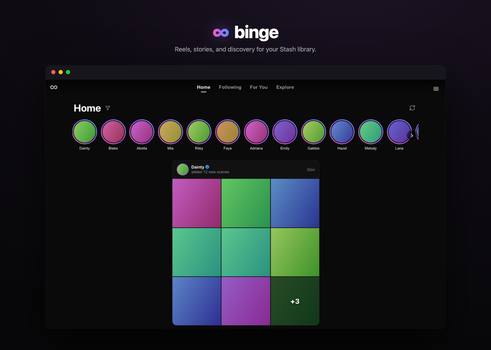
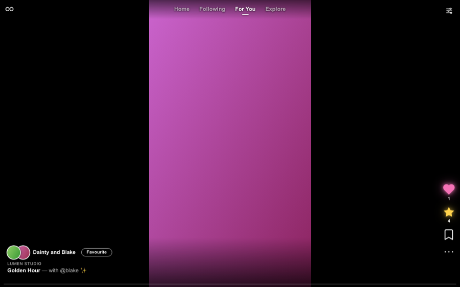
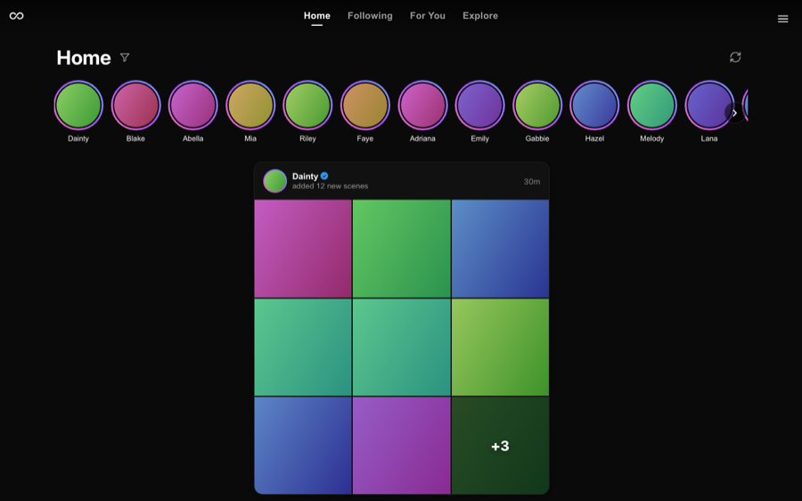
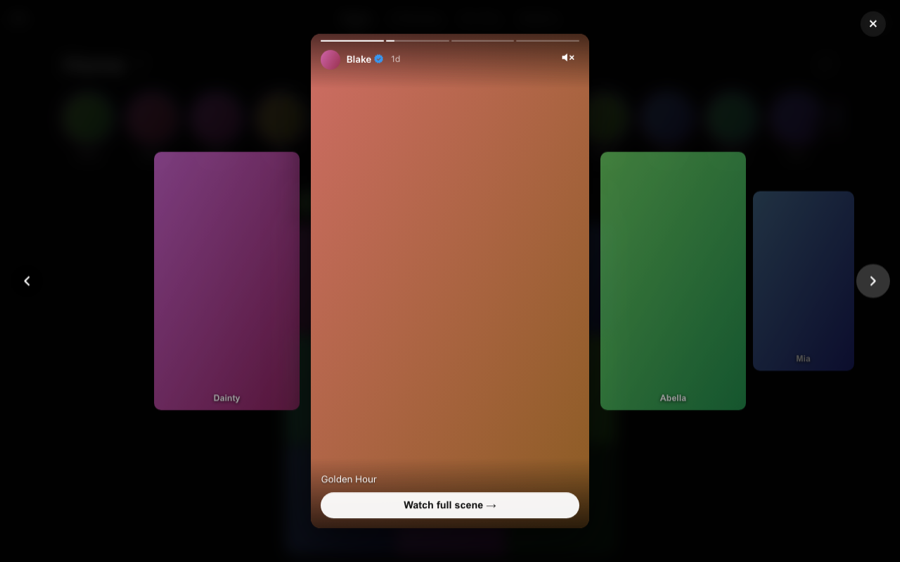
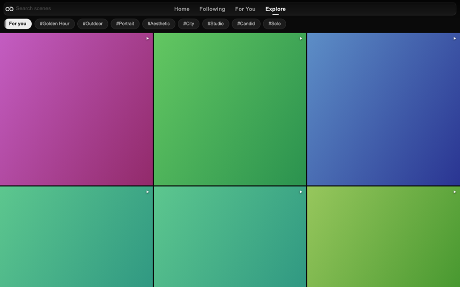
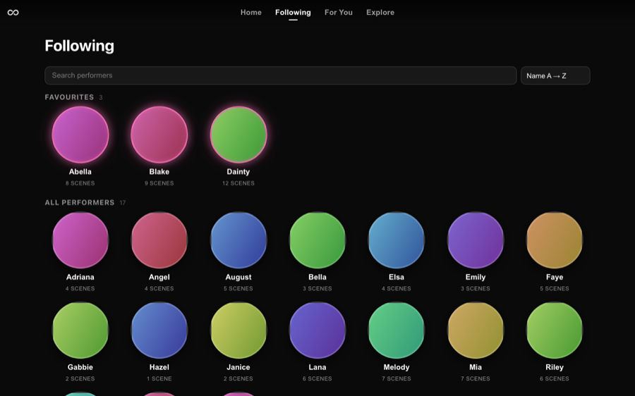
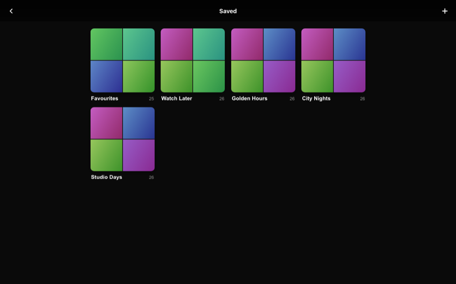
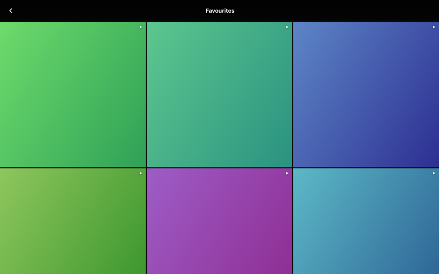
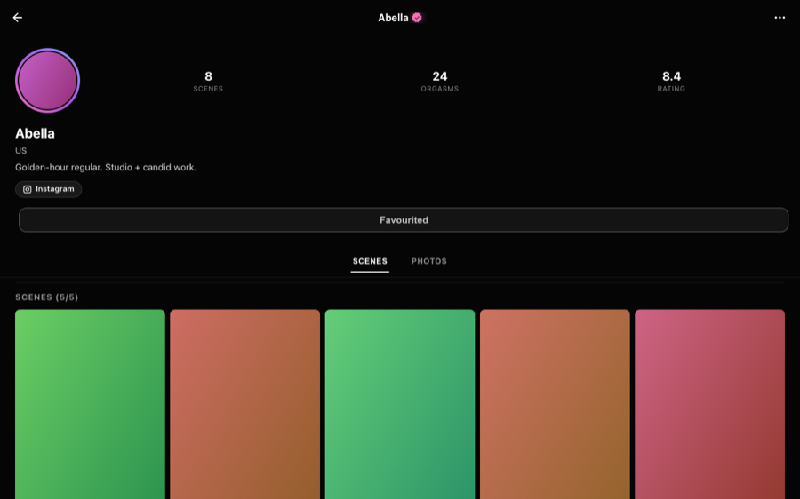

# Binge

An Instagram-shaped social + discovery layer for [Stash](https://github.com/stashapp/stash). Vertical reel, stories, performer profiles, StashDB-powered discovery — all backed by Stash's existing GraphQL API. Web plugin; native [iOS port](https://github.com/ordureconnoisseur/binge-ios) tracks feature-parity.

<p align="center"></p>

---

## Highlights

- **Vertical reel** — swipe-through scenes, double-tap-to-like, action stack (rating, multiview, scribe, save, ⋯).
- **Home stories + feed** — IG-style stories row of performers with new content (library + StashDB + optional Reddit) above a paginated scene feed. Bulk imports collapse into single pack cards.
- **Performer profiles** — bio, stats, scene grid, image grid, social-link strip with branded icons for Twitter / Instagram / TikTok / Reddit / OnlyFans / Fansly + a 🔗 popup for the rest. Library + StashDB-only variants share the layout.
- **StashDB discovery** — DISCOVER + TRENDING cards in Home; Follow performers + Add scenes you don't have, both via Stash-style scrape modals.
- **Mobile-first** — bottom nav, hover-card mini-profiles, performer `@mention` links. Touch + desktop parity.

---

## What it does

> Screenshots are **demo-mode** captures — fictional placeholder content (gradients + performer first names), so nothing real is shown. The StashDB discovery surfaces (Follow/Add modals, Discover bar, social links) need live data and aren't pictured.

### Reel · For You



Vertical swipe through scenes. Tap to play/pause, double-tap to like, swipe to advance. Right-side action stack: **Heart · Rate · Multiview · Scribe · Bookmark · ⋯**. Filter chips at top constrain the random feed by performer / tag / studio and persist as you scroll.

<br clear="all" />

<!-- TODO: 18-reel-more-menu — reel ⋯ menu (Auto-scroll + Open in Stash) -->

### Home



**Stories row** of performers with fresh content (library scenes within your lookback + StashDB new releases + Reddit posts when binge-server is reachable). Tap a bubble → IG-style story viewer with auto-advance and a "Watch full scene" CTA into the reel.

**Scene feed** of IG-style cards: preview video, performer header (avatar + hover-card), title + expandable description + hashtags, action row. Bulk imports of one performer collapse into a single **Pack card** with a 3×3 mosaic — keeps one prolific performer from dominating the feed.

**Discovery cards** mix in. StashDB scenes you don't own appear with a coloured **DISCOVER** (co-stars) or **TRENDING** pill, an avatar stack of library performers on the scene, and `@mention` text links for unfollowed co-performers. Tap **+ Follow** for one-tap onboarding or **⋯ → Add scene to library** to scrape + create locally.

<br clear="all" />

<p align="center"></p>

<!-- TODO (live data): discovery-card — DISCOVER/TRENDING pill + avatar stack + Follow + @mentions -->

### Explore



Search bar (Stash's `q` filter), recent-tag chips (from your interaction history), tile grid of scenes. A **Discover Performers** bubble row at top scrolls through StashDB's recent-activity performers (filtered to your enabled genders). Tap → profile.

<br clear="all" />

<!-- TODO (live data): explore-discover-bar — Discover Performers bubble row -->

### Following · Saved



Following lists performers you've favourited, sorted by recent activity. Saved holds your collections (Watch Later, Favourite ★, and any custom ones); each opens a 3-column grid.

<br clear="all" />

<p align="center">
  
  
</p>

### Performer profile



Full-screen page mirroring Instagram's profile layout: avatar (with binge's pink→purple→blue story ring on new content), bio, stats, **social-link row**, Favourite/Follow action, Scenes + Images tabs. StashDB-only profiles get a **+ Follow** button instead of the favourite toggle, plus a Stash-style scrape modal. Hash-routed: `#/p/<localId>` and `#/sdbp/<stashDBId>` — both deep-linkable.

<br clear="all" />

<!-- TODO (live data): profile-stashdb (Follow + badged tiles) · profile-mixin -->

---

## StashDB discovery

Single Settings toggle, default ON, no-op without a StashDB API key. Three surfaces:

1. **Home discovery cards** — DISCOVER (recent StashDB scenes featuring a performer you favourite, with an unfollowed co-star as the headliner) + TRENDING (`sort: TRENDING` against StashDB). Both pills brand-pink; the label is the differentiator.
2. **Follow modal** — Tap **+ Follow** anywhere → Stash-style sheet with the StashDB performer record + image carousel pre-filled. Submit → `performerCreate` with a `stash_ids` link so future merges resolve.
3. **Add scene modal** — On any discovery card, **⋯ → Add scene to library** scrapes title / code / director / date / urls / cover, resolves performer + studio `stash_ids` to local IDs, submits `sceneCreate`.

**Performer-profile mixin** (off by default): toggle the StashDB pill in any library profile's scenes heading to interleave that performer's unowned StashDB scenes into the grid. Mixed-in tiles wear a blue badge and open AddSceneModal on tap.

<!-- TODO: 10-follow-modal — open FollowPerformerModal with scraped data + carousel -->
<!-- TODO: 11-add-scene-modal — open AddSceneModal with cover carousel + chips -->

### Social links

Bio row carries a smart link strip. Known platforms (Twitter, Instagram, TikTok, Reddit, OnlyFans, Fansly) get branded pills; everything else collapses into a 🔗 N popup. Reads from Stash's deprecated `twitter`/`instagram`/`url` fields and the modern `urls[]` array, de-duped and host-normalised.

<!-- TODO: 07-other-links-popup — 🔗 N popup with miscellaneous URLs -->

### Hover cards

Hover (desktop) or tap (mobile) any performer name or avatar → mini-profile pops up with avatar, name, gender · age, "In library" (green) or "StashDB" (blue) pill, **Open profile** + (for StashDB-only) **Follow**. Available on discovery cards, library scene cards, and Discover Performers bubbles.

<!-- TODO: 12-hovercard — in-library + StashDB hover cards side-by-side -->

---

## Mobile

At ≤720px:

- **Bottom nav** replaces the top tab bar — five slots, IG-style icons, auto-hides on reel scroll-down.
- **Floating chrome** — home/burger top-right on Home, filter pill on For You.
- **Menu page** lists Saved + Settings as cards.
- Sheets use Stash's native bottom-sheet pattern with detents. `safe-area-inset-bottom` respected.

<!-- TODO: 13-mobile-home / 14-mobile-reel / 15-mobile-menu / 16-mobile-nav -->

---

## Companion plugin integrations

Detected at runtime — install whichever you want; binge degrades gracefully when they're absent.

| Plugin | What it adds |
|-|-|
| [Refract](https://github.com/ordureconnoisseur/stash-refract) | Tints binge's accent to match your refract palette (opt-in toggle) |
| [stash-multiview](https://github.com/ordureconnoisseur/stash-multiview) | 4-cell grid button in the action stack — tap to queue, hold to open |
| [stash-advanced-rating](https://github.com/ordureconnoisseur/stash-advanced-rating) | Per-criterion 0–5 rating modal in reel + profile |
| [stash-scribe](https://github.com/ordureconnoisseur/stash-scribe) | Scribe pencil → LLM-powered review writing |
| [binge-server](https://github.com/ordureconnoisseur/binge-server) | Reddit posts in the stories row (separate Go daemon) |

---

## Install

Add this URL as a source in **Stash → Settings → Plugins → Available Plugins → Add Source**:

```
https://ordureconnoisseur.github.io/plugins/main/index.yml
```

Install **Binge** from the list. An infinity-symbol button appears in Stash's main nav — click it.

### Manual

```bash
unzip binge-vX.Y.Z.zip -d ~/.stash/plugins/binge/
# then: Stash → Settings → Plugins → Reload Plugins
```

Preferences live in `localStorage` under `binge.*` — nothing in Stash's own config gets touched.

---

## Settings

Open binge → ⋯ → Settings (desktop) or Menu → Settings (mobile).

| Setting | Default | Notes |
|-|-|-|
| Genders to surface | All | Five toggles. Drives discovery feed + Discover Performers row. |
| Stream type | Auto | Auto / Direct / MP4 / WebM / HLS |
| Show galleries in feed | On | Mix galleries into Home |
| Recent window | 30 days | How far back "new" means. 7 / 14 / 30 / 60 / 90 / 180 / 365 |
| Include StashDB new releases | On | In stories + Home. No-op without a StashDB API key. |
| Mix StashDB into profiles | Off | Also flip-able per-profile from the scenes-heading pill |
| Include Reddit posts | On | Requires binge-server reachable (silent no-op otherwise) |
| binge-server URL | `http://localhost:7878` | Override if remote |
| binge-server configuration | — | Auto-detects your Stash API key + accepts a Reddit cookie. Visible only when binge-server is reachable. |
| Follow refract accent | Off | Mirror refract's accent palette into binge |
| Auto-scroll | Off | Advance to next scene when current ends (reel ⋯ menu) |
| Show debug overlay | Off | Per-slide debug HUD; `\` hotkey in reel |

---

## Architecture

- **Vite + React 19 + TypeScript** bundled to a single-file SPA (`dist/index.html`) that Stash serves from `/plugin/binge/assets/index.html`. `binge.entry.js` injects the nav button.
- **All Stash data via GraphQL** (`/graphql`, same-origin cookie auth). No backend of binge's own.
- **StashDB direct** — queries `https://stashdb.org/graphql` with the user's API key (read from Stash's stashbox config). 12h localStorage cache.
- **Hash routing** — `#/home`, `#/foryou`, `#/explore`, `#/following`, `#/saved`, `#/settings`, `#/menu`, `#/p/<id>`, `#/sdbp/<id>`. Direct deep-links + browser back.
- **Runtime plugin detection** — ASR / scribe / multiview / refract presence queried at boot, gated through React context.

---

## Development

```bash
git clone https://github.com/ordureconnoisseur/binge.git
cd binge
npm install
npm run dev     # Vite dev (SPA only — no Stash data)
npm run build   # produces dist/index.html
npm run push    # build + deploy via scripts/push.sh (write your own)
```

Stack: Vite · React 19 · TypeScript · TanStack Virtual (reel virtualization).

Minimal `scripts/push.sh`:

```bash
#!/usr/bin/env bash
set -euo pipefail
scp binge.yml dist/binge.entry.js dist/index.html \
    user@host:'/path/to/stash/plugins/binge/'
```

---

## License

AGPL-3.0. See [LICENSE](./LICENSE). (Matches Stash's own license.)

<!-- Screenshots/ holds demo-mode captures (npm run walkthrough with
     SHOTS=1): hero/reel, home, story, profile, explore, following, saved,
     collection.

     STILL TODO — these need LIVE data (demo mode can't show them), so
     capture with Showcase blur on for SFW hosting:
       discovery-card · profile-stashdb · profile-mixin · other-links-popup
       explore-discover-bar · follow-modal · add-scene-modal · hovercard
       settings · reel-more-menu · mobile (home/reel/menu/nav, ≤720px)
-->
